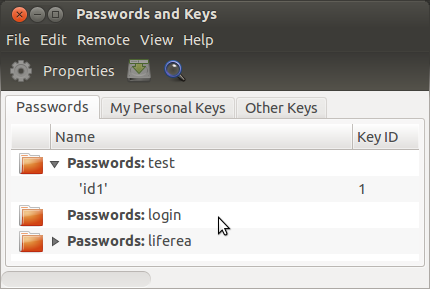

Since GTK+ 3.0 and the broad introduction of GObject Introspection (GIR)
one now can switch from using the existing [GnomeKeyring Python
module](http://www.mindbending.org/bending-gnome-keyring-with-python-part-1/)
to direct GIR-based access. This allows reducing the Python runtime
dependency. Below you find a simple keyring access script unlocking a
keyring named \"test\" adding a new entry and dumping all entries in the
keyring. This code uses the generic secret keyring type and was
originally written for a [Liferea
plugin](http://liferea.git.sourceforge.net/git/gitweb.cgi?p=liferea/liferea;a=blob_plain;f=plugins/gnome-keyring.py;hb=HEAD)
that allows [Liferea](http://liferea.sf.net) to store feed passwords
into GnomeKeyring:

```python
    from gi.repository import GObject
    from gi.repository import GnomeKeyring

    keyringName = 'test'

    def unlock():
        print 'Unlocking keyring %s...' % keyringName
        GnomeKeyring.unlock_sync(keyringName, None)

    def dump_all():
        print "Dump all keyring entries..."
        (result, ids) = GnomeKeyring.list_item_ids_sync(keyringName)
        for id in ids:  
           (result, item) = GnomeKeyring.item_get_info_sync(keyringName, id)
           if result != GnomeKeyring.Result.OK:
              print '%s is locked!' % (id)
           else:
                 print '  => %s = %s' % (item.get_display_name(), item.get_secret())

    def do_query(id):
        print 'Fetch secret for id %s' % id
        attrs = GnomeKeyring.Attribute.list_new()
        GnomeKeyring.Attribute.list_append_string(attrs, 'id', id)
        result, value = GnomeKeyring.find_items_sync(GnomeKeyring.ItemType.GENERIC_SECRET, attrs)
        if result != GnomeKeyring.Result.OK:
            return

            print '  => password %s = %s' % (id, value[0].secret)
        print '     keyring id  = %s' % value[0].item_id

    def do_store(id, username, password):
        print 'Adding keyring entry for id %s' % id
        GnomeKeyring.create_sync(keyringName, None)
        attrs = GnomeKeyring.Attribute.list_new()
        GnomeKeyring.Attribute.list_append_string(attrs, 'id', id)
        GnomeKeyring.item_create_sync(keyringName, GnomeKeyring.ItemType.GENERIC_SECRET, repr(id), attrs, '@@@'.join([username, password]), True)
        print '  => Stored.'

    # Our test code...
    unlock()
    dump_all()
    do_store('id1', 'User1', 'Password1')
    do_query('id1')
    dump_all()
```
For simplicity the username and password are stored together as the
secret token separated by \"@@@\". According to the documentation it
should be possible to store them separately, but given my limited Python
knowledge and the [missing GIR
documentation](http://www.roojs.org/seed/gir-1.2-gtk-3.0/seed/) made me
use this simple method. If I find a better way I\'ll update this post.
If you know how to improve the code please post a comment! The code
should raise a keyring password dialog when run for the first time in
the session and give an output similar to this:
```python
    Unlocking keyring test...
    Dump all keyring entries...
      => 'id1' = TestA@@@PassA
    Adding keyring entry for id id1
      => Stored.
    Fetch secret for id id1
      => password id1 = TestA@@@PassA
         keyring id  = 1
    Dump all keyring entries...
      => 'id1' = TestA@@@PassA
```
You can also check the keyring contents using the **seahorse** GUI where
you should see the \"test\" keyring with an entry with id \"1\" as in
the screenshot below.


