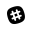

# CheatSheetCollection

# List of contents:
- [X] ***[Containers](Containers/List.md)***
- [X] ***[Agile](Agile/List.md)***
- [X] ***[DevOps Automation](DevOps_Automation/List.md)***
- [ ] ***[DevOps Linux](DevOps_Linux/List.md)***
- [ ] ***[DevOps Services](DevOpsServices/List.md)***
- [ ] ***[Languages](Languages/List.md)***
- [ ] ***[Network](Network/List.md)***
- [ ] ***[Scripting](Scripts/List.md)***
- [ ] ***[Security](Security/List.md)***
- [ ] ***[Solutions](Solutions/List.md)***
- [ ] ***[Virtualization](Virtualization/List.md)***
- [ ] ***[Windows](Windows/List.md)***
- [ ] ***[Glib Examples](Glib_Examples/List.md)***
- [ ] ***[Go Examples](Go_Examples/List.md)***
- [ ] ***[Javascript Examples](Javascript_Examples/List.md)***
- [ ] ***[PHP Examples](PHP_Examples/List.md)***
- [X] ***[Python Examples](Python_Examples/List.md)***
- [X] ***[Programming Language Examples Alike Cookbook](Programming_Language_Examples_Like_Cookbook/List.md)***

# Slack groups:

| Name                         | URL                                     |
|------------------------------|-----------------------------------------|
|  DevOps Engineers             | https://devopsengineers.slack.com       |
|  SecurityHQ                   | https://securityhq.slack.com            |
|  RedHat Admins                | https://redhat-admins.slack.com         |
|  DevOps Links                 | https://devopslinks.slack.com           |
|  DevsPL                       | https://devspl.slack.com                |
|  Chef Community               | https://chefcommunity.slack.com         |
|  Openstack Community          | https://openstackcommunity.slack.com    |
|  Puppet Community             | https://puppetcommunity.slack.com       |
|  Windows Admins               | https://winadmins.slack.com             |
|  OG-AWS                       | https://og-aws.slack.com                |
|  Azure Stack                  | https://azurestackblog.slack.com        |
|  Docker Community             | https://dockercommunity.slack.com       |
|  Google Cloud Community       | https://googlecloud-community.slack.com |       |
